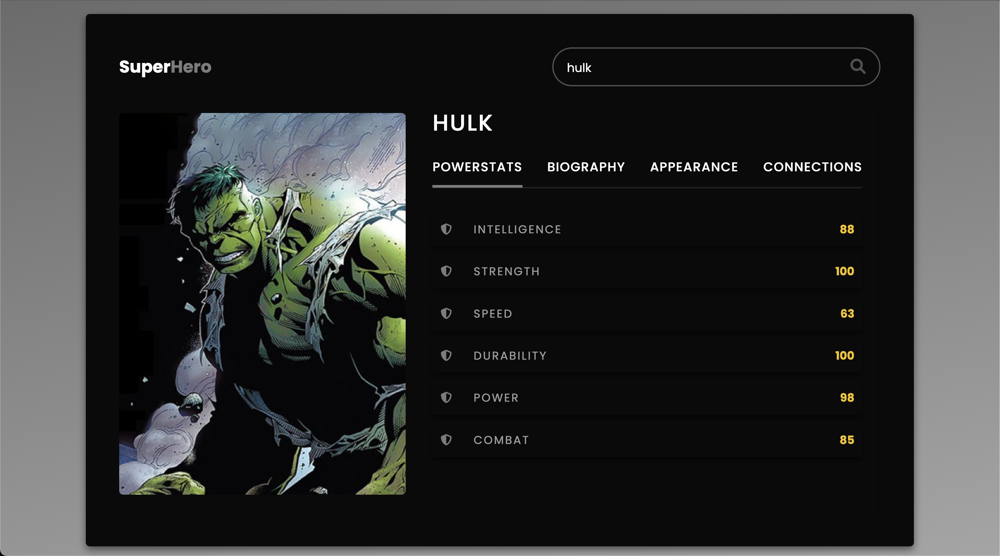

# Super-Hero-App
Welcome to my SuperHero Application

## Description:
Welcome to the Superhero App! This app displays information about various superheroes, including their descriptions, biographies, family connections, power stats, and appearance stats.

## Installation:
To use the Superhero App, simply download or clone the repository to your local machine, and open the index.html file in a web browser.

## How to Use:
Once you open the index.html file, you will see a list of all the superheroes in the app. To view more information about a specific superhero, click on their name in the list. You will be taken to a page that displays the superhero's description, biography, family connections, power stats, and appearance stats. Use the navigation buttons to switch between different sections of the page.

## Contributors:
This application was created by [Kevin Barraza]
## Questions:
For any inquiries, please refer to my GitHub page at https://github.com/eskevin14th. I will be happy to respond to any questions you may have.